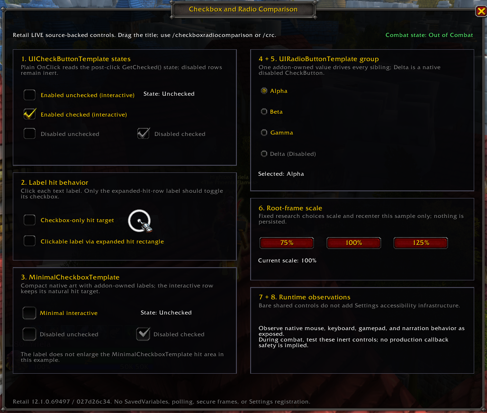

# CheckboxRadioComparison

`CheckboxRadioComparison` is the independently owned Checkboxes & Radios module in the `RetailUIResearch` harness for the presentation and interaction questions left open by `12.1.0/Analysis/CheckboxesAndRadios.md`. It compares shared checkbox and radio templates without integrating them into Blizzard Settings or a production addon.

## Baseline

- Retail client/source: `12.1.0.69497`
- LIVE source commit: `027d26c3406d3de2cbd2b1f67d468fe033a1bcd4`
- Source scope: Retail LIVE only; PTR was not consulted

## Source / static validation

Static/source validation established the template ownership, callback contracts, label hit-area behavior, explicit radio synchronization model, Settings boundary, and conservative combat interpretation documented in `12.1.0/Analysis/CheckboxesAndRadios.md`.

## Included controls

- `UICheckButtonTemplate`: interactive enabled examples plus disabled unchecked and disabled checked states, all with addon-owned labels.
- Label hit comparison: one separate label leaves the ordinary checkbox hit target unchanged; the second uses `SetHitRectInsets(0, -235, 0, 0)`, following the source-supported expanded-hit-rectangle pattern, so its text area toggles the same CheckButton.
- `MinimalCheckboxTemplate`: one interactive compact checkbox at its natural hit size plus disabled unchecked and disabled checked examples. Labels remain addon-owned.
- `UIRadioButtonTemplate`: Alpha, Beta, and Gamma choices plus a natively disabled Delta choice.
- Scale controls: fixed 75%, 100%, and 125% buttons apply only to the sample root frame, recenter it, and do not persist.
- Combat diagnostic: `PLAYER_REGEN_DISABLED` and `PLAYER_REGEN_ENABLED` directly update the visible combat-state text. Title dragging is conservatively blocked during combat; inert checkbox and radio interaction remains available for observation.

The radio group owns one addon value, `selectedRadio`. Every enabled radio click assigns that value, iterates over all sibling controls, applies `SetChecked(radio.value == selectedRadio)`, and updates the summary. `UIRadioButtonTemplate` does not provide mutual exclusion by itself, and this sample deliberately does not call `CreateRadioButtonGroup`.

The bare shared templates expose no Settings-owned keyboard, gamepad, or narration framework. This sample adds no custom accessibility navigation or narration infrastructure; note only behavior naturally observable in the Retail client.

## LIVE runtime validation

The module was tested by the user through the consolidated `RetailUIResearch` harness on Retail LIVE `12.1.0.69497`.

- `UICheckButtonTemplate` unchecked/checked interaction, state text, and the initially checked enabled example passed. Disabled examples remained inert.
- `MinimalCheckboxTemplate` interaction and its natural compact hit behavior passed. Disabled examples remained inert.
- The checkbox-only label retained its ordinary non-expanded hit behavior. The `SetHitRectInsets` label area toggled its checkbox as intended.
- Alpha, Beta, and Gamma selection passed. The addon-owned `selectedRadio` value and sibling `SetChecked()` refresh kept exactly one normal choice selected. Disabled Delta remained inert.
- 75%, 100%, and 125% root-frame scaling passed, including repeated switching.
- During actual combat, the diagnostic changed correctly and the tested inert/sample-local interactions continued to work: scaling, both standard enabled checkbox examples, radio selection, the minimal checkbox, the checkbox-only target, and the expanded clickable-label checkbox.
- No Lua errors or blocked-action output were observed during the supplied test.

The combat result is deliberately narrow. It does **not** establish that arbitrary production configuration callbacks, protected-frame operations, secure actions, runtime frame reconfiguration, or taint-sensitive downstream work are safe during combat.

Keyboard, gamepad, and narration behavior was not exhaustively runtime validated. Bare shared controls do not automatically provide the higher-level Settings accessibility/navigation infrastructure.

### Screenshot

`CheckboxRadioComparison.png` is the user-authored Retail LIVE visual/runtime reference for this module.

## Commands and constraints

- `/checkboxradiocomparison`
- `/crc`
- Opened from the `RetailUIResearch` launcher; it no longer auto-opens independently
- No SavedVariables or persistent position/scale
- No secure frames or gameplay APIs
- No Settings registration or `SettingsCheckboxTemplate`
- No `CreateRadioButtonGroup`
- No polling or `OnUpdate`
- No PTR research

Successful interaction with these isolated non-secure controls during combat does **not** prove that arbitrary production configuration callbacks are combat-safe. Downstream protected or restricted work must be evaluated independently.

## Optional follow-up checklist

1. Observe any native keyboard, gamepad, or narration behavior without adding custom support.
2. Repeat visual inspection at other display resolutions or UI scale configurations if production-host decisions require it.
3. Report any environment-specific Lua errors, blocked actions, visual ambiguities, or input differences without generalizing them beyond the reproduced path.
