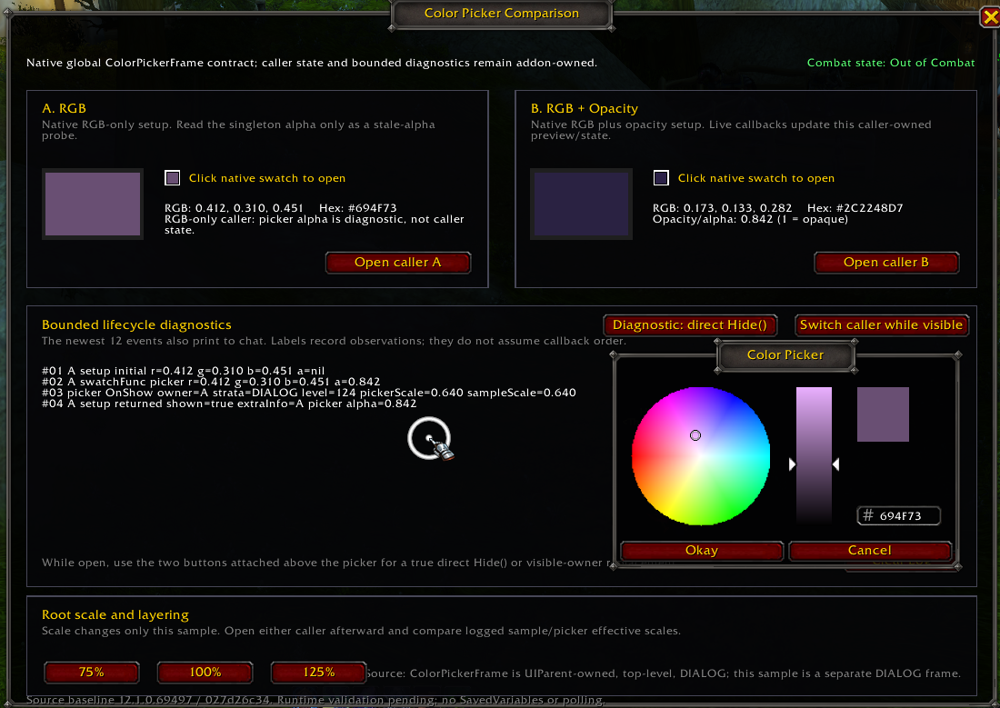
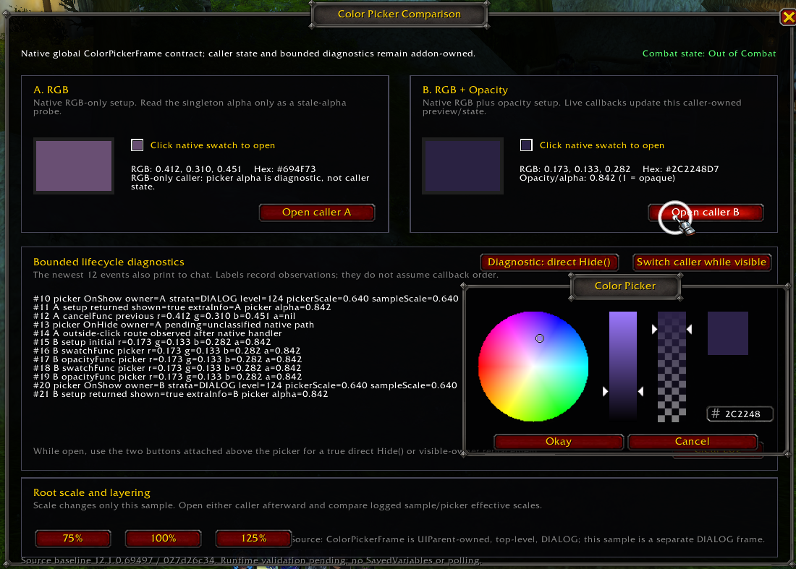

# Color Picker Comparison

## Purpose and validation status

`ColorPickerComparison` is the compact, independently owned Color Picker runtime module in the `RetailUIResearch` harness. It exercises Blizzard's current global `ColorPickerFrame` contract with two harmless addon-owned callers. It is not a replacement picker, product prototype, or third-party compatibility layer.

The implementation is source-backed against Retail `12.1.0.69497` and LIVE source commit `027d26c3406d3de2cbd2b1f67d468fe033a1bcd4`. The user completed the native Retail LIVE runtime pass with Color Picker replacement/enhancement addons disabled.

Result: the ordinary RGB/RGBA lifecycle, singleton, scale, and layering probes passed. Actual-combat runtime is a **qualified PASS** for opening and ordinary non-secure picker interaction, with a separate gameplay-input limitation observed while the picker was visible. No Lua, protected-action, or obvious taint error was supplied.

The authoritative combined source/runtime analysis is [ColorPicker.md](../../../../12.1.0/Analysis/ColorPicker.md). PTR source and third-party Color Picker addon source were not consulted.

## Architecture

The module creates one addon-owned comparison window and two independent caller-state tables:

- **A. RGB** owns normalized red, green, and blue values.
- **B. RGB + Opacity** owns normalized red, green, blue, and alpha/opacity values.

Each caller presents a larger preview, a clickable `Button` inheriting Blizzard's reusable `ColorSwatchTemplate`, normalized numeric readouts, and a display-only derived hexadecimal value. The hexadecimal text is diagnostic output, not an editor.

The authoritative values remain in the caller tables outside `ColorPickerFrame`. Live callbacks update the relevant caller as harmless preview/current state. `cancelFunc(previousValues)` restores that caller from the setup-time values supplied back by the global picker. Okay has no sample-owned commit callback; it leaves the live-updated caller value in place.

Opacity and alpha are numerically identical here: `1` means fully opaque and `0` means transparent. Caller A does not semantically own alpha. Its logged `ColorPickerFrame:GetColorAlpha()` value exists only for the stale-singleton-alpha probe.

## Controls and diagnostics

- Click either native swatch or its **Open caller A/B** button to configure the global singleton with `ColorPickerFrame:SetupColorPickerAndShow(info)`.
- Use the native picker wheel, value strip, alpha strip where present, built-in RGB hex field, Okay, Cancel, outside click, and Escape behavior unchanged.
- While the picker is open, two addon-owned diagnostic buttons appear immediately above it:
  - **Diagnostic: direct Hide()** calls only `ColorPickerFrame:Hide()` after recording the request. It adds no accept or rollback behavior.
  - **Switch caller while visible** calls the other caller's setup while the singleton is still shown. It does not queue ownership or resolve the first caller.
- **Clear Log** resets the bounded on-screen history. Clicking the sample window while the picker is open is itself an outside click, so clear before opening or after dismissal.
- **75% / 100% / 125%** scale only the addon-owned sample root and recenter it. They do not scale or reparent the global picker.
- `/colorpickercomparison` and `/cpc` toggle the module through the shared harness coordinator.

The sample keeps the newest 12 numbered entries on screen and also prints them to chat. It records setup owner/values, `swatchFunc`, `opacityFunc`, picker RGB/alpha, `cancelFunc` previous values, button observations, direct Hide, `OnShow`/`OnHide`, Escape/outside routes, owner transitions, frame strata/level, effective scales, and manual combat-state transitions.

The two picker-attached buttons are ordinary addon-owned children used only so their clicks remain within the picker's ancestry. A normal button in the separate sample window would trigger native outside-click cancellation before its `OnClick`, preventing a clean direct-Hide or already-visible-replacement probe. The diagnostic buttons do not replace or monkey-patch picker methods.

## Source/static validation

The following expectations are verified from the current Mainline source:

- Retail exposes one UIParent-owned, top-level, `DIALOG`-strata `ColorPickerFrame` singleton rather than a reusable picker template.
- The supported opening contract is `SetupColorPickerAndShow(info)` with normalized RGB, a required `swatchFunc`, and optional opacity/cancel fields.
- `swatchFunc` and `opacityFunc` receive no values and read current values from the global frame.
- Okay repeats the live callbacks and hides; it has no separate Okay callback.
- Cancel, native outside click, and the picker Escape-binding path call `cancelFunc(previousValues)` before hiding.
- Direct `Hide()` runs the picker hide path without accepting or cancelling.
- A later setup overwrites singleton callback/state fields. It does not provide a caller queue.
- RGB-only setup hides the alpha UI but does not source-visibly reset intrinsic alpha.
- The global picker is not parented to or scaled with this sample window.
- No picker source-visible secure template, action-bar visibility gate, or combat branch was found.

## Retail LIVE runtime findings

### Singleton and callback behavior

- Caller A opened the global singleton. Invoking caller B while it remained visible replaced the active setup/owner without an intervening `OnHide` and without automatically cancelling A. This reconfigured the same visible picker; it did not close A and open a second frame.
- During RGB-plus-opacity testing, both `swatchFunc` and `opacityFunc` fired for RGB changes. Both also fired for opacity changes.
- Callbacks fired at high frequency and could repeat with identical values. They did not behave as clean, independent per-property change notifications.
- Setup could dispatch caller callbacks before `OnShow`. One opacity-enabled setup first exposed alpha `1.0`; later setup callbacks observed the requested `0.55`. Callers therefore need to tolerate setup-time intermediate states.

### Alpha ownership

- After caller B left singleton alpha at approximately `0.842`, RGB-only caller A opened with `a=nil` but observed `ColorPickerFrame:GetColorAlpha()` at approximately `0.842`.
- The stale alpha persisted across later A/B openings and sample root-scale changes.
- Caller A correctly kept this value diagnostic-only. RGB-only callers must not treat the singleton alpha as their authoritative state.

### Acceptance and cancellation

- Okay invoked the relevant live callback or callbacks again and then hid.
- Cancel invoked `cancelFunc` with captured previous state and hid.
- Escape followed cancellation behavior.
- Outside click followed cancellation behavior.
- Direct `ColorPickerFrame:Hide()` hid without the sample adding accept or cancel behavior.

These observations match the source-derived lifecycle in this tested composition. They do not convert intrinsic callback counts or ordering into undocumented guarantees.

### Scale and layering

| Sample root scale | Picker effective scale | Sample effective scale |
|---|---:|---:|
| 75% | 0.640 | 0.480 |
| 100% | 0.640 | 0.640 |
| 125% | 0.640 | 0.800 |

Changing the addon-owned root scale did not change the UIParent-owned picker scale. The picker reported `DIALOG` strata and frame level `124`, remained independently positioned and usable, and showed no obvious clipping or interaction-blocking layering defect. Stale singleton alpha persisted across scale changes.

### Actual combat — qualified PASS

During actual combat:

- the sample logged combat entry;
- both caller A and caller B opened successfully;
- native callbacks executed;
- Cancel and outside-click cancellation worked;
- the picker hid normally;
- no Lua error, protected-action error, or obvious taint error was observed in the supplied test.

While `ColorPickerFrame` was visible, the user could not activate a normal action-bar ability. Dismissing it restored gameplay interaction, and some attempted outside interactions caused native outside-click cancellation.

This is not a blanket “combat-safe” result. It is only a qualified PASS for these isolated addon-owned non-secure callbacks, with a separate native gameplay-input limitation observed while the picker was visible. It does not prove that arbitrary production callbacks, protected operations, secure actions, runtime reconfiguration, or taint-sensitive downstream work are safe.

### Gameplay-input source investigation

LIVE source proves that the picker registers synchronous `GLOBAL_MOUSE_DOWN` while shown and cancels/hides on a mouse down outside its ancestry. That directly explains the observed outside-click dismissal.

The inspected source does **not** prove why normal action-bar activation was unavailable:

- Mainline has no picker combat branch or action-bar gate.
- `UISpecialFrames` handling only hides listed windows; no modal blocker was found there.
- The picker XML has `enableMouse="true"` but does not explicitly enable keyboard input or propagation; the shared XML schema defaults both keyboard attributes to false.
- Its `OnKeyDown` method only checks the game-menu binding.
- The built-in hex EditBox has `autoFocus="false"`, although manual focus is a plausible key-input factor and its picker-specific Enter handler does not clear focus.
- Action-bar source contains no visibility condition for `ColorPickerFrame`.

The outside-mouse route, a focused hex EditBox, or a broader engine input-dispatch detail are possible explanations, but the supplied evidence does not distinguish mouse activation from keybind activation or record hex focus. Exact causality remains unresolved and must not be attributed to combat lockdown, taint, frame strata, keyboard capture, or modality without a focused reproduction.

## Screenshots

Two user-authored Retail LIVE screenshots are preserved exactly as supplied:

`ColorPickerComparison2.png` shows caller A with the RGB-only picker layout (no alpha strip). The log records setup-time `swatchFunc`, `DIALOG` strata, frame level `124`, effective scale `0.640`, and stale picker alpha `0.842` while A's caller alpha remains `nil`.

`ColorPickerComparison1.png` shows caller B's opacity-enabled picker with the alpha strip. Its bounded log shows caller A outside-click cancellation followed by B setup/callback activity and `OnShow`, a sequential transition distinct from the separately observed setup-while-visible replacement. Repeated `0.842` callback values are visible.

The task brief referred to `ColorPickerComparisonq.png`; no file with that exact name was present. The first actual file is `ColorPickerComparison1.png`. Neither image was renamed, deleted, recompressed, or otherwise modified.

## Focused follow-up questions

- Separately reproduce mouse-click and keybind action activation while the picker is visible, both in and out of combat.
- Repeat with the native hex field never focused, focused, and after Enter; record current keyboard focus.
- Observe `ColorPickerFrame:IsKeyboardEnabled()` and `GetPropagateKeyboardInput()` at runtime.
- Characterize exact callback counts for additional wheel, value, alpha, and hex sequences only if a production decision needs them.
- Test already-visible opacity-to-RGB layout refresh more exhaustively if that unsupported ownership transition matters.
- Exhaustively assess keyboard, gamepad, narration, focus, and accessibility behavior only in a dedicated pass.

## Explicit exclusions

The module has no SavedVariables, polling, `OnUpdate`, secure infrastructure, Settings registration, HSV editor, custom hex editor, palette, class-color system, copy/paste system, custom `ColorSelect`, replacement picker, third-party detection, or compatibility branch. It does not inspect ColorPickerPlus and does not create an Odysseus ColorLab Plus project.
