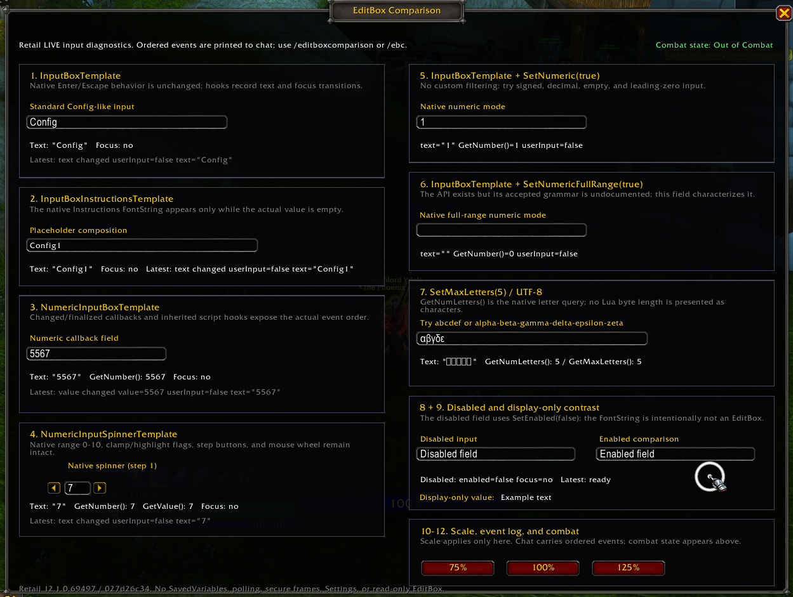

# EditBoxComparison

`EditBoxComparison` is the independently owned EditBoxes module in the `RetailUIResearch` harness. It provides a focused LIVE runtime surface for the engine behaviors investigated in `12.1.0/Analysis/EditBoxes.md`; it does not prescribe a production Config implementation.

## Baseline and status

- Retail client/runtime: `12.1.0.69497`
- LIVE source commit: `027d26c3406d3de2cbd2b1f67d468fe033a1bcd4`
- Source research: `12.1.0/Analysis/EditBoxes.md`
- Source scope: Retail LIVE only; PTR was not consulted
- Static/source research: complete
- Supplied Retail LIVE runtime validation: complete

## Source / static validation

Source inspection established the shared-template inheritance, callback signatures, native instruction composition, numeric spinner contract, generated EditBox API signatures, absence of a generic read-only EditBox, and the separation between EditBox presentation state and caller-owned validation/persistence.

The module contains:

- `InputBoxTemplate` with a separate label, explicit size, and `SetAutoFocus(false)`;
- `InputBoxInstructionsTemplate` using its native `Instructions` FontString;
- `NumericInputBoxTemplate` with source-defined changed and finalized callbacks;
- `NumericInputSpinnerTemplate` with native `0-10` range configuration and clamp/highlight flags;
- separate `SetNumeric(true)` and `SetNumericFullRange(true)` fields;
- `SetMaxLetters(5)` with `GetNumLetters()` / `GetMaxLetters()` diagnostics;
- a natively disabled EditBox beside an enabled field;
- a FontString display-only contrast rather than an invented read-only EditBox;
- ordered chat diagnostics, root-only scale controls, and an event-driven combat indicator.

## Retail LIVE runtime validation

The user tested the module through the consolidated harness on Retail LIVE `12.1.0.69497`. It loaded and operated both out of combat and during actual combat without a supplied Lua error or blocked-action report.

### Standard and instructions fields

- Direct typing produced `OnTextChanged(..., isUserInput=true)`; programmatic refreshes observed during root-scale changes produced `isUserInput=false` across standard, instructions, numeric, and spinner controls.
- The standard field observed Escape as focus lost then the Escape hook (`#81`, `#82`). Enter was observed as the Enter hook then focus lost (`#86`, `#87`). This ordering is limited to the tested template/composition.
- The instructions field accepted normal focus and typing, and the native instruction presentation remained functional. The instruction is a separate template-owned FontString, not EditBox value text. Exact instruction-region mouse-hit behavior was not separately reported.

### Numeric controls

- `NumericInputBoxTemplate` typing `1`, `12`, and `123` produced value changes with `isUserInput=true`. Enter at 123 produced finalized value, focus lost, then the Enter hook (`#20`-`#22`). Empty text returned/finalized as `0` in this runtime composition; this does not rewrite the generated API's nilable return signature.
- `SetNumeric(true)` accepted digits and empty text and rejected `-`, `.`, and `,`. Empty text produced `GetNumber()=0`. This supports unsigned integer-style editing, not application validation or range handling.
- `SetNumericFullRange(true)` accepted `123`, `-1`, `1.5`, `-`, `1.`, `-1.`, `-1.5`, `00123`, and empty text. `.` alone and `,` alone were rejected. Entering `1,5` rejected the comma, leaving `15` with `GetNumber()=15`.
- Observed full-range interpretations included empty -> 0, `-` -> 0, `1.` -> 1, `-1.` -> -1, `1.5` -> 1.5, `-1.5` -> -1.5, and `00123` -> 123 while the editing text retained its leading zeroes.
- The full-range field therefore provided structured signed/period-decimal editing, including useful partial states, rather than unrestricted text. Period input was accepted and comma rejected only in the tested client/runtime; this is not a claim about every WoW locale.
- Native spinner button interaction included `5 -> 6 -> 7 -> 8 -> 9` and `9 -> 8 -> 7`. Button changes logged value changed first and text changed with `isUserInput=false` second, such as `#51` then `#52` for value 6.

### Limits, presentation, scale, and combat

- `SetMaxLetters(5)` accepted `abcde` and `αβγδε`, reported five letters, and rejected a sixth ASCII or Greek letter. This is limited to those inputs; it is not a general Unicode/grapheme conclusion and does not characterize `SetMaxBytes`.
- The disabled EditBox and FontString display-only contrast rendered correctly. No copy/select behavior or generic read-only EditBox is claimed.
- Root-only scaling passed at 75%, 100%, and 125%, including repeated switching. Nothing is persisted and there are no SavedVariables.
- The isolated addon-owned, non-secure controls and sample-local diagnostics remained interactive during actual combat in the tested session.

The combat PASS is deliberately narrow. It does not establish universal safety for production callbacks, protected-frame operations, secure actions, runtime reconfiguration, or taint-sensitive downstream work.

## Screenshot

`EditBoxComparison.png` is the user-authored Retail LIVE visual/runtime reference for the completed module test.

## Remaining runtime questions

- spinner min/max overrun behavior in this exact sample;
- spinner mouse-wheel behavior in this exact sample;
- `SetMaxBytes` / `GetMaxBytes` behavior;
- exhaustive keyboard, gamepad, and narration behavior;
- broader locale behavior beyond the tested period/comma result;
- exact instruction-region mouse-hit behavior;
- broader Unicode/grapheme and invisible-character behavior.

## Commands and constraints

- `/editboxcomparison`
- `/ebc`
- Registered as `editboxes` through `RetailUIResearch:RegisterSample`; Core owns open/toggle coordination.
- Initially hidden; no independent `PLAYER_LOGIN` auto-open.
- No SavedVariables, persistence, secure frames, Settings registration, validation framework, custom read-only composition, custom UTF-8 library, custom navigation, gamepad layer, or narration layer.
- No SearchBox, multiline, chat, money, Auction House, Character Services, or other feature-owned input comparisons.
- No polling is added by the module. The native spinner template retains its source-owned held-button repeat behavior.
