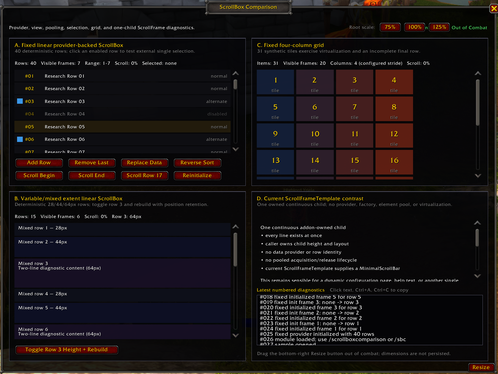

# ScrollBoxComparison

`ScrollBoxComparison` is the independently owned ScrollBox module in the `RetailUIResearch` harness. It turns the source findings in `12.1.0/Analysis/ScrollBox.md` into an isolated Retail LIVE runtime instrument. It is not a reusable scrolling framework and does not prescribe a production addon migration.

## Baseline and status

- Retail client/source target: `12.1.0.69497`
- LIVE source commit: `027d26c3406d3de2cbd2b1f67d468fe033a1bcd4`
- Source research: `12.1.0/Analysis/ScrollBox.md`
- Source scope: Retail LIVE only; PTR content was not consulted
- Static implementation validation: complete; eight-file LuaCheck and repository whitespace validation passed
- Retail LIVE runtime validation: complete on `12.1.0.69497`; no Lua errors were observed
- Screenshot: current user-authored LIVE visual/runtime reference, `ScrollBoxComparison.png`

The generic names, lifecycle hooks, and architectural conclusions remain source-verified facts. The results under **Retail LIVE runtime validation** are separate user-observed behavior from this exact isolated composition. Engineering conclusions and untested boundaries are identified separately.

## Generic architecture exercised

The three repeated-collection compositions use the current generic SharedXML pattern:

```text
CreateDataProvider
        |
        v
linear or grid view + addon-owned element initializer/resetter
        |
        v
WowScrollBoxList viewport
        |
        v
MinimalScrollBar connected by ScrollUtil.InitScrollBoxListWithScrollBar
```

The data provider owns ordered element data. The view owns element sizing, layout, visible-range calculation, and pooled frame lifecycle. The viewport owns scrolling and clipping. The scrollbar is a separately created current controller visual. Selection is deliberately attached as a separate behavior rather than stored in a visible row frame.

No Settings row/category template, Auction House row, Encounter Journal row, or other feature-owned implementation is copied.

## Composition A: fixed linear collection

The fixed collection starts with 40 synthetic table elements. Every element has a stable numeric ID, label, status, and deterministic disabled/alternate/emphasis state.

- Host: `WowScrollBoxList`
- View: `CreateScrollBoxListLinearView`
- Extent: explicit fixed `26px`
- Element frame type: ordinary addon-owned `Button`
- Provider: `CreateDataProvider`
- Scrollbar: `MinimalScrollBar`
- Visibility: `SetHideIfUnscrollable(true)`; no polling
- Selection: extrusive single `SelectionBehaviorMixin`

Visible status reports provider size, currently acquired frame count, visible provider-index range, scroll percentage, and selected element ID.

### Provider and scroll controls

- `Add Row` inserts one deterministic new element through `DataProviderMixin:Insert`.
- `Remove Last` removes the last provider element through `RemoveIndex`.
- `Replace Data` alternates between four fitting rows and forty overflowing rows by assigning a new provider. This also exercises scrollbar visibility and provider-reassignment lifecycle.
- `Reverse Sort` alternates source-supported ascending and descending provider comparators.
- `Scroll Begin` and `Scroll End` call the verified base APIs without interpolation.
- `Scroll Row 17` calls `ScrollToElementDataIndex` with center alignment, clamped to the current provider size.
- `Reinitialize` calls `ReinitializeFrames` for the currently visible rows.

The operations are deterministic so event logs can be compared between runs.

### Recycling diagnostics

Acquired physical row frames receive a monotonically assigned sample-local frame number. The module observes source-supported acquired, initialized, reset, and released lifecycle points. Its rolling numbered log distinguishes a newly created physical frame from a pooled acquisition and records the old and new numeric element IDs.

Only scalar diagnostic IDs are retained. The module does not keep stale element-data table references or alter Blizzard's frame pool.

### Stale-state prevention

Every fixed-row initializer explicitly establishes all sample-owned data-dependent state:

- ID, label, and status text;
- icon visibility and color;
- selected and deterministic emphasis textures;
- enabled/disabled state;
- alpha.

The resetter clears text and textures, restores enabled state and alpha, and leaves only the previous scalar ID for diagnostics. Invariant textures, FontStrings, and scripts are created once per physical frame. The sample intentionally demonstrates state pressure without shipping a stale-state defect.

### Selection model

Clicking an enabled visible row calls the separate selection behavior with that row's current element data. The behavior owns selection by element-data identity. Its callback updates the old and new visible frames independently and exposes the selected numeric ID.

Retail LIVE testing confirmed that selection remained associated with element-data identity after a selected row left the viewport and physical row frames were recycled. This result applies to the sample's extrusive single-selection composition; multi-selection and intrusive selection were not tested.

## Composition B: variable/mixed extent collection

The variable list contains 15 deterministic elements cycling through `28px`, `44px`, and `64px` extents. The view uses `SetElementExtentCalculator`; each element's source-owned diagnostic table supplies its extent.

`Toggle Row 3 Height + Rebuild` changes row 3 between `64px` and `82px`, changes its text, and calls:

```lua
scrollBox:Rebuild(ScrollBoxConstants.RetainScrollPosition)
```

This is an explicit source-supported full rebind and extent recalculation. It avoids pretending that direct mutation of an element-data field emits a provider event. Retail LIVE testing repeatedly changed row 3 between 64 and 82 pixels without overlap, gaps, duplicate rows, stale height, or scrollbar incoherence.

In one recorded retained-position test, the viewport was approximately rows 8–12 at 67 percent before the rebuild and rows 7–12 at 64 percent afterward. The total scrollable extent changed, so the percentage also changed, while the viewport remained in the same logical region. This is evidence for this tested composition, not a universal retained-position guarantee.

`ScrollUtil.AddResizableChildrenBehavior` is intentionally omitted. This composition tests a deterministic data-driven extent calculator and explicit rebuild first; automatic child-size observation and its queued full update remain a separate runtime question.

## Composition C: fixed grid

The grid uses 31 synthetic tiles so its final four-column row is incomplete.

- Host: `WowScrollBoxList`
- View: `CreateScrollBoxListGridView(4, ...)`
- Element size: explicit `82 x 54`
- Spacing: `5px` horizontally and vertically
- Provider: `CreateDataProvider`
- Scrollbar: `MinimalScrollBar`

The visible status labels four columns as the **configured stride**, not a runtime-derived official column-count API. The fixed stride deliberately remains four as the window changes width. Width-derived `SetStrideExtent` is not used because the source research found no LIVE consumer and left its exact resize behavior as a focused follow-up question.

Retail LIVE testing confirmed the explicit four-column stride through scrolling, resizing, and 75/100/125-percent root scaling. At 100 percent scroll, the incomplete final row contained tiles 29, 30, and 31 with no phantom fourth tile. No overlap or visible layout corruption was observed, the scrollbar remained coherent, and the visible-frame population changed with viewport dimensions. Width-derived responsive stride was intentionally not tested.

## Composition D: current ScrollFrame contrast

The compact comparison uses the current `ScrollFrameTemplate` with one addon-owned continuous child. The child contains several ordinary FontStrings and exists in full; there is no provider, element factory, row identity, pool, or virtualization.

An `OnSizeChanged` callback updates only the owned child's width. This is event-driven geometry maintenance, not polling. The example demonstrates why a current ScrollFrame remains appropriate for one composed configuration/help/detail surface while ScrollBox is appropriate for repeated provider-backed collections.

Retail LIVE testing confirmed mouse-wheel and scrollbar operation, coherent resizing and root scaling, and correct word wrapping as the owned child width changed. No provider or recycling lifecycle was required. `ScrollFrameTemplate` remains current for this use case; it is not obsolete.

## Scrollbar results

All three ScrollBox compositions use `MinimalScrollBar` and `ScrollUtil.InitScrollBoxListWithScrollBar`. Each bar enables `SetHideIfUnscrollable(true)` rather than using addon-owned visibility code.

Retail LIVE testing confirmed:

1. coherent scrolling and bar behavior in the implemented viewports;
2. synchronization with visible scroll percentage;
3. fixed-list behavior after replacing 40 rows with four fitting rows and back;
4. coherent behavior after root scaling and window resizing.

No `UIPanelScrollBarTemplate`, FauxScrollFrame, HybridScrollFrame, or custom scroll-offset loop is present.

## Resize and scale tests

The ordinary addon-owned root frame is resizable from `1100 x 780` through `1360 x 960`. The four panels and their viewports are anchored to respond to both width and height changes. The bottom-right `Resize` button uses `StartSizing`/`StopMovingOrSizing` and records only the completed size, avoiding continuous chat output.

Resize and movement are intentionally blocked by sample policy during combat. Dimensions and position are not persisted.

Root-only buttons apply 75%, 100%, and 125% scale, recenter the sample, and preserve no state. They do not change global UI scale.

Retail LIVE testing covered representative sizes from approximately `1100 x 780` through `1360 x 960`. Layouts and bars remained coherent at 75%, 100%, and 125% root scale and after returning to 100%. Fixed-list acquisition/release adjusted with viewport dimensions, and the grid retained its explicit four-column configuration.

## Diagnostics and logging

The module uses deterministic numbered diagnostics. Explicit user actions, open/close-relevant state, scale, resize completion, selection, and combat transitions print to chat. High-frequency lifecycle activity is retained in a bounded 50-entry scrolling multiline EditBox instead of continuously spamming chat; click it and use Ctrl+A, Ctrl+C to copy the authoritative history. Accidental user edits are immediately restored from the sample-owned buffer.

Composition status text updates through ScrollBox callbacks such as scroll and visible data-range changes. No addon-owned `OnUpdate` is used.

Retail LIVE testing confirmed that the `ScrollingEditBoxTemplate` accepted focus, Ctrl+A selected the retained history, and Ctrl+C copied it. Attempted typing did not corrupt the authoritative Lua-owned buffer. Enter and Escape lost or cleared focus as observed in this exact composition; that observation is not generalized to every EditBox. The 50-entry bound, numbering, and chat-output semantics remained intact.

## Combat result and caveat

`PLAYER_REGEN_DISABLED` and `PLAYER_REGEN_ENABLED` directly update the visible state and record the transition. The sample uses only addon-owned ordinary non-secure frames and inert synthetic data.

Source inspection found no generic ScrollBox combat gate. During actual Retail combat, the tested addon-owned non-secure interactions—including scrolling, fixed-list interaction and selection, harmless provider mutation, and root-scale controls—operated without a Lua error. Moving and resizing were intentionally blocked during combat by sample policy.

This is a narrow PASS for the isolated sample. It does **not** prove that arbitrary ScrollBox callbacks, protected parents or operations, secure actions, runtime protected-frame reconfiguration, production callbacks, or taint-sensitive downstream work are universally safe. Addons must evaluate their own protected-operation and taint context.

## Retail LIVE runtime validation

The user completed the runtime pass on Retail LIVE `12.1.0.69497`:

- the approximately 280-pixel-wide vertical launcher showed all six buttons, and its height followed the entry count;
- the A/B/C/D quadrants and `MinimalScrollBar` companions rendered coherently without initialization errors;
- the 40-row fixed list used only a visible physical-frame subset, scrolled top-to-bottom-to-top, and completed provider mutations and programmatic scrolling without errors;
- physical frames were released, reacquired as pooled frames, and rebound to different element data; no stale deterministic visual state was observed;
- external single selection survived scrolling and recycling;
- variable extents rebuilt repeatedly with the bounded retained-position result described above;
- all 31 grid tiles rendered, including the correct three-tile final row;
- the one-child current `ScrollFrameTemplate` remained coherent without provider or recycling machinery;
- the diagnostic history could be focused, selected, and copied without permitting user edits to corrupt its source buffer;
- resizing, 75/100/125-percent root scales, and returning to 100 percent remained coherent;
- the tested ordinary non-secure interactions operated during actual combat without Lua errors, subject to the caveat above.

These results validate this small research harness and its explicit compositions. They do not make it a general launcher or scrolling framework.

## Screenshot



`ScrollBoxComparison.png` is the user-authored Retail LIVE default-window visual/runtime reference for the completed module test.

## Deliberately omitted APIs and behaviors

- `ScrollToNearestByPredicate`: source forwarding is suspicious in this snapshot; the initial sample uses the explicit verified index API instead.
- Width-derived `SetStrideExtent`: no LIVE consumer was found; fixed stride provides a clearer initial grid probe.
- `ScrollUtil.AddResizableChildrenBehavior`: variable extent is tested first with deterministic data plus explicit `Rebuild`.
- Multi-selection, intrusive selection, deselection flags, tree views, sequence views, drag/reorder, and TableBuilder: each adds a separate lifecycle question not required for the initial architecture test.
- Managed scrollbar anchor switching: simple native hide-if-unscrollable behavior is sufficient for the first probe.
- Keyboard/gamepad navigation and custom narration: generic row activation/navigation remains feature-owned and requires a separately designed accessibility test.
- SavedVariables, position/size persistence, secure templates, protected game actions, Settings registration, production data, polling, and module-local TOC metadata.

## Remaining runtime questions

- `ScrollToNearestByPredicate` optional-argument behavior;
- width-derived `SetStrideExtent` behavior;
- automatic `ScrollUtil.AddResizableChildrenBehavior` invalidation;
- multi-selection and intrusive selection;
- tree and sequence views;
- drag/reorder and TableBuilder integration;
- managed-scrollbar anchor switching;
- exhaustive keyboard, gamepad, narration, and accessibility behavior;
- universal combat and taint guarantees.

## Commands and constraints

- `/scrollboxcomparison`
- `/sbc`
- Registered as `scrollbox` through `RetailUIResearch:RegisterSample`
- Initially hidden; Core owns open/toggle coordination
- No independent login event or auto-open
- No SavedVariables, per-module TOC, addon-owned polling, or secure infrastructure
- Runtime PASS claims are limited to the tested composition and observations above
