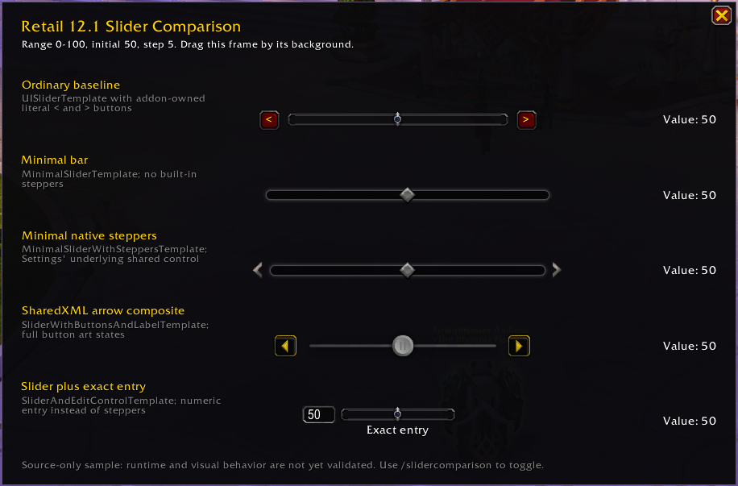

# Slider Comparison

## Purpose

This is the independently owned slider module in the `RetailUIResearch` harness for visually comparing reusable Blizzard slider designs on Retail 12.1. It has no relationship to the runtime code of OdysseusBuffBars or OdysseusUtilitySuite.

The sample has no SavedVariables, Ace, LibSharedMedia, LibDataBroker, OBB, or OUS dependency.

## Source baseline

- Retail build: `12.1.0.69497`
- Live source: branch `live`, commit `027d26c3406d3de2cbd2b1f67d468fe033a1bcd4`
- PTR source: branch `ptr`, commit `e9e8bf68cb7b4177566532f8da9373590759587d`
- Live/PTR result: the 24 slider-related files listed in [SliderControls.md](../../../../12.1.0/Analysis/SliderControls.md) are byte-identical.

The corrected sample was successfully tested by the user on Retail LIVE build `12.1.0.69497`.

## Controls shown

All rows use range `0-100`, initial value `50`, and step `5`.

1. **Ordinary baseline**
   - `UISliderTemplate`
   - bar: NineSlice `SliderBar` texture kit
   - thumb: `Interface\Buttons\UI-SliderBar-Button-Horizontal`, `32 x 32`
   - addon-owned `UIPanelButtonTemplate` buttons with literal `<` and `>` text
2. **Minimal bar**
   - `MinimalSliderTemplate`
   - bar atlases: `Minimal_SliderBar_Left`, `_Minimal_SliderBar_Middle`, `Minimal_SliderBar_Right`
   - thumb atlas: `Minimal_SliderBar_Button`
3. **Minimal native steppers**
   - `MinimalSliderWithSteppersTemplate`
   - the same shared control created by Blizzard Settings slider rows
   - back atlas: `Minimal_SliderBar_Button_Left`
   - forward atlas: `Minimal_SliderBar_Button_Right`
4. **SharedXML arrow composite**
   - `SliderWithButtonsAndLabelTemplate`
   - bar/thumb: `common-slider-track` and `common-slider-thumb`
   - arrow states: `Interface\Buttons\UI-SpellbookIcon-PrevPage-*` and `UI-SpellbookIcon-NextPage-*`
5. **Slider plus exact entry**
   - `SliderAndEditControlTemplate`
   - `UISliderTemplate` plus `NumericInputBoxTemplate`

## Dependency

The root `RetailUIResearch.toc` includes `Blizzard_SharedXML` for this module. It also declares `Blizzard_Settings_Shared` for the separate Buttons & Frames module's `SettingsFrameTemplate` comparison.

```text
## Dependencies: Blizzard_SharedXML, Blizzard_Settings_Shared
```

`Blizzard_SharedXML` defines all five demonstrated templates. The sample does not load or depend on `Blizzard_Settings`.

## Researched but intentionally omitted

- `Settings.CreateSlider` is appropriate for a registered addon Settings category, but not needed to demonstrate the underlying control. Blizzard's Settings row creates `MinimalSliderWithSteppersTemplate`, which is shown directly.
- `SettingsSliderControlTemplate`, Settings advanced wrappers, and checkbox-slider rows require Settings objects, initializers, callback handles, and layout lifecycle.
- Edit Mode and customization sliders use feature-owned data and managers even though their underlying shared controls are shown here.
- `PropertySliderTemplate`, `UserScaledSliderTemplate`, and `UnitPopupSliderTemplate` add binding/wrapper behavior without distinct relevant artwork.
- `MinimalScrollBar` is a vertical scroll controller, not a value slider.
- `ScaleControlFrameTemplate` calls housing-specific APIs and uses housing-owned scale behavior. Its complete control is not suitable for this sample.
- `OptionsSliderTemplate` is explicitly in Blizzard's deprecated templates.
- The color picker's opacity slider is a named global vertical instance, not a reusable virtual template.

See [SliderControls.md](../../../../12.1.0/Analysis/SliderControls.md) for source paths, dimensions, state behavior, dependency tracing, classifications, and risks.

## How to test

1. Manually copy the complete `RetailUIResearch` directory into `_retail_/Interface/AddOns/`.
2. Start World of Warcraft or reload the UI.
3. The `RetailUIResearch` launcher opens automatically; click `Sliders`. Use `/slidercomparison` or `/sliders` as compatibility shortcuts.
4. Drag each thumb and test each available decrement/increment or numeric-entry control.
5. Check endpoint disabled states at 0 and 100.
6. Drag the comparison frame by its background to confirm movement.
7. Capture a screenshot and save it in this directory as `SliderComparison.png`.

Do not add a placeholder or generated screenshot. [SliderComparison.png](SliderComparison.png) is the actual tested LIVE capture.

## Runtime and visual findings

### Successful LIVE test

The user manually copied the sample into the Retail AddOns directory and tested it on LIVE build `12.1.0.69497`.

- All five comparison rows displayed successfully.
- `MinimalSliderWithSteppersTemplate` initialized at 50.
- Its native left/right steppers advanced values by the configured step of 5.
- Normal slider interaction worked.
- No Lua error occurred.
- No Blizzard Settings subsystem or custom stepper handlers were required.

This supports classification **A — directly reusable** for the tested standalone scenario.

### Callback readout correction

During the first test, clicking either minimal native stepper made the external readout display 487 and continue displaying 487. Source tracing proved that the native slider was still operating correctly.

`Init(50, 0, 100, 20, nil)` correctly calculated a step of 5. The problem was the sample callback:

```lua
function(value)
```

CallbackRegistry invokes ordinary function callbacks as `func(owner, ...)`, so that parameter received the generated callback-owner ID—487 in that session. The actual slider value was the second argument. The callback was corrected to:

```lua
function(_, value)
```

The user retested after this correction and confirmed correct native stepper and slider behavior. No clamp, Settings object, custom arrow handler, or other workaround was needed.

### Visual preference

`MinimalSliderWithSteppersTemplate` is the preferred candidate for a future OdysseusBuffBars slider replacement because its presentation is modern, compact, and visually consistent with current Blizzard UI. This is a research recommendation; OBB has not been modified.

The sample's nearly borderless dark comparison frame was also positively received as a clean UI presentation. This is retained only as a future UI-reference observation, not an OBB design requirement.

### Screenshot



`SliderComparison.png` is the real screenshot from the tested LIVE comparison and shows all five sample rows.
