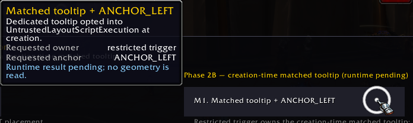
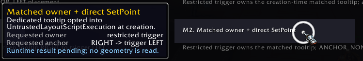
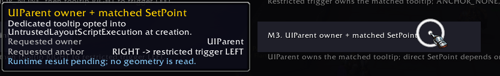
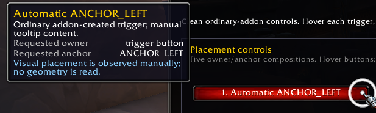
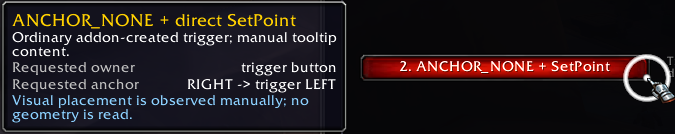
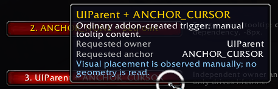
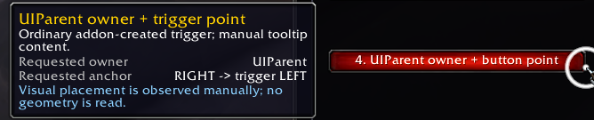
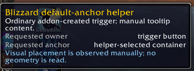
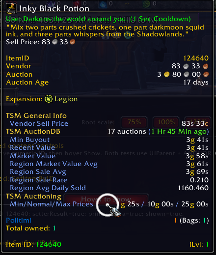
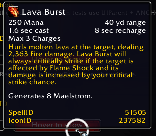

# Tooltip Comparison — Phase 1 and Phase 2

## Purpose and validation status

`TooltipComparison` is the controlled Tooltips module in the `RetailUIResearch` harness. Its frozen Phase-1 surface establishes a clean control group for ownership, anchoring, positioning, manual content, data-backed content, and combat observation using ordinary addon-created frames. Phase 2A is the frozen unmatched restricted-layout comparison; Phase 2B adds a second, creation-time matched tooltip without changing the earlier test sequences.

This is not a tooltip library or a production recommendation. Static validation and the primary Retail LIVE Phase-1 clean-control pass are complete. Selected Phase-1 runtime screenshots are preserved under `Media/Phase1/`. Phase 2A has completed its first LIVE runtime pass. Phase 2B has completed LIVE out-of-combat and combat testing in the tested synthetic scope, and its M1-M3 screenshots are preserved under `Media/Phase2/`.

## Source baseline

- Retail client/source: `12.1.0.69587`
- LIVE source branch: `live`
- LIVE source commit: `8ea15b61e45c0ed4eba01439c90757f86eb78d34`
- Source scope: Retail Mainline only; Classic and PTR were not consulted

Current source establishes that `GameTooltip:SetOwner` is a native operation rather than a Lua-visible implementation. Blizzard uses automatic anchor modes, `ANCHOR_NONE` followed by direct `SetPoint`, UIParent-owned cursor tooltips, and `GameTooltip_SetDefaultAnchor`. Generated documentation marks frame geometry as contextually secret and marks `SetPoint` as checking forbidden-layout inheritance. These source facts motivate the cases below; they do not predict their runtime result.

## Five placement tests

Every placement trigger is an ordinary addon-created `UIPanelButtonTemplate`. Each test records the requested topology and combat state before making native tooltip calls, then records completion and shown state only if the call sequence returns normally. Visual placement is observed by the user, not calculated or classified by Lua.

### 1. Automatic `ANCHOR_LEFT`

Sequence:

```lua
GameTooltip:SetOwner(triggerButton, "ANCHOR_LEFT")
```

Question: Does native automatic left-side placement work for an ordinary addon-owned button without reading frame geometry?

### 2. `ANCHOR_NONE` plus direct `SetPoint`

Sequence:

```lua
GameTooltip:SetOwner(triggerButton, "ANCHOR_NONE")
GameTooltip:ClearAllPoints()
GameTooltip:SetPoint("RIGHT", triggerButton, "LEFT", -8, 0)
```

Question: Can a clean ordinary addon frame support explicit immediate-left placement through a native anchor dependency without extracting geometry into Lua?

### 3. `UIParent` plus `ANCHOR_CURSOR`

Sequence:

```lua
GameTooltip:SetOwner(UIParent, "ANCHOR_CURSOR")
```

Question: Does the known-independent owner/cursor topology behave coherently in this clean sample? The trigger controls the tooltip lifetime but is neither owner nor positioning dependency.

### 4. `UIParent` owner plus point relative to the button

Sequence:

```lua
GameTooltip:SetOwner(UIParent, "ANCHOR_NONE")
GameTooltip:ClearAllPoints()
GameTooltip:SetPoint("RIGHT", triggerButton, "LEFT", -8, 0)
```

Question: In a clean addon composition, can ownership remain independent while positioning depends directly on an ordinary addon frame? This is not the restricted OdysseusBuffBars row experiment.

### 5. `GameTooltip_SetDefaultAnchor`

Sequence:

```lua
GameTooltip_SetDefaultAnchor(GameTooltip, triggerButton)
```

Question: How does Blizzard's current default-anchor helper behave when an ordinary addon trigger is supplied as its parent/owner, while the helper positions against Blizzard's default tooltip container?

## Phase-1 LIVE clean-control results

The primary pass used Retail LIVE `12.1.0.69587`, ordinary addon-created TooltipComparison controls, 100% root scale, and an out-of-combat state. It did not use restricted-layout synthetic frames, forbidden-aspect mutation, or geometry extraction. All five placement sequences completed with no Lua errors, showed `GameTooltip`, visually anchored as intended, and cleaned up successfully.

- **P1 — PASS:** `SetOwner(triggerButton, "ANCHOR_LEFT")` placed the tooltip immediately to the left of the ordinary addon trigger.
- **P2 — PASS:** `SetOwner(triggerButton, "ANCHOR_NONE")`, `ClearAllPoints()`, and direct `SetPoint` placed the tooltip immediately to the left of the ordinary addon trigger.
- **P3 — PASS:** `SetOwner(UIParent, "ANCHOR_CURSOR")` produced cursor-relative placement without trigger-frame ownership or a trigger-relative point dependency.
- **P4 — PASS:** `SetOwner(UIParent, "ANCHOR_NONE")` plus direct `SetPoint` relative to the ordinary trigger successfully separated ownership from positioning in this clean composition.
- **P5 — PASS:** `GameTooltip_SetDefaultAnchor(GameTooltip, triggerButton)` used its default/helper-selected placement rather than placing the tooltip immediately beside the trigger. P5 solves a different placement problem from P1 and P2.

These are runtime observations for the exact clean-control compositions above, not universal guarantees for `GameTooltip` or other addon frames.

## Content tests

The five placement rows use manually supplied content through `SetText`, `AddLine`, and `AddDoubleLine` so placement is not conflated with data availability.

Two separate data-backed controls use `UIParent` plus `ANCHOR_CURSOR`:

- item ID input plus `SetItemByID`;
- spell ID input plus `SetSpellByID`.

The project did not contain a stable generic item/spell pair intended for this sample, so phase 1 uses positive whole-number input fields instead of hardcoding an unrelated runtime ID. Invalid or empty input is rejected before any tooltip call.

The module observes `TOOLTIP_DATA_UPDATE` only while one of its data-backed tests remains active and only records events that have no ID or match the current `GameTooltip` data instance. This is a tooltip-data observation. It is not evidence that an `AsyncCallbackSystem`, `ItemEventListener`, or spell callback occurred. The module installs no global `TooltipDataProcessor`, Async, or item-listener hooks.

The primary out-of-combat LIVE content pass used item ID `124640` for I1 and spell ID `51505` for S1. Each test used `UIParent` ownership with `ANCHOR_CURSOR`, returned the observed `setterResult=true`, showed the tooltip, rendered normal item or spell content, produced no Lua error, and cleaned up successfully. This establishes only the tested IDs and compositions. It does not establish cold-cache behavior or participation by `AsyncCallbackSystem`, `ItemEventListener`, or another callback system.

## Scale and combat observations

In the tested Phase-1 clean-control sample, P1-P5 continued to complete without errors at 75%, 100%, and 125% root scale, and their visual placement remained consistent with the 100% baseline. This is limited to the tested sample and is not a universal scale-safety claim.

During a real LIVE combat session at 100% scale, P1-P5 completed successfully, showed their tooltips, cleaned up, and produced no Lua or forbidden-layout error. I1 with item ID `124640` and S1 with spell ID `51505` also completed successfully in combat with no Lua error.

During a later LIVE combat session, TooltipComparison root scaling was changed while combat remained active. Placement and data-backed tooltip tests continued to function across the tested 75%, 100%, and 125% states, with no Lua errors observed. Exact per-test coverage differed by scale and is not a complete Cartesian matrix. The explicitly logged coverage included I1 and S1 at 100% and 125%, P2-P4 at 75%, and an earlier P1-P5 pass before the first explicitly logged scale change.

## Geometry prohibition

The module deliberately does not call `GetLeft`, `GetRight`, `GetTop`, `GetBottom`, `GetCenter`, `GetRect`, `GetWidth`, `GetHeight`, `GetSize`, or `GetEffectiveScale` for tooltip placement or diagnostics. Generated Retail documentation allows these values to become secret under contextual layout/scale aspects. The earlier OBB failure demonstrated that addon-side arithmetic on such a secret coordinate can fail.

Direct native anchor calls avoid exposing screen coordinates to sample Lua. They are not automatically universal: `SetPoint` can still be rejected when a dependency would inherit incompatible forbidden layout aspects.

## Phase-1 restricted-layout boundary

Phase 1 adds no forbidden aspects, no `DisableUntrustedLayoutScriptsTemplate`, no deliberately tainted object, and no synthetic or native restricted trigger.

Blizzard's intrinsic AuraButton is not equivalent to this sample. The native button carries forbidden aspects, and its dedicated private tooltip is explicitly given matching inheritable layout aspects before `SetOwner`. A clean addon button cannot establish the behavior of that composition.

Phase 2A now uses separately created trigger and tooltip objects for a controlled synthetic experiment. It does not mutate the shared global `GameTooltip` or use a production addon as a test surface.

## OBB motivation and boundary

The known OBB evidence is motivation only:

- reading row geometry and performing addon-side coordinate arithmetic failed when `rowLeft` was a secret number;
- `GameTooltip:SetOwner(OBBRow, "ANCHOR_NONE")` was separately rejected because the dependent object would inherit `UntrustedLayoutScriptExecution`;
- `GameTooltip:SetOwner(UIParent, "ANCHOR_CURSOR")` is the currently runtime-tested production fallback for that context.

This module does not modify, load, inspect at runtime, or integrate with OBB. It does not claim that phase-1 `ANCHOR_LEFT` will work on the restricted OBB row.

For the tested ordinary addon-created TooltipComparison controls, conventional `GameTooltip` ownership and anchoring patterns worked both out of combat and in combat. The Phase-1 control result supports a narrower comparison: the prior OBB failure cannot be explained merely by ordinary addon ownership, direct `SetPoint` use, `GameTooltip` use, or combat alone. The restricted layout/aspect composition remains the important distinguishing condition. This does not prove the exact OBB root cause, establish P4 against the OBB weapon row, or make the clean-control results portable to all addon frames. `ANCHOR_LEFT` on the restricted OBB weapon row requires controlled runtime testing. OBB remains frozen and unchanged.

Engineering lesson: prefer expressing tooltip placement through native ownership/anchor relationships instead of extracting trigger-frame coordinates into addon Lua. Native layout relationships must still be compatible with forbidden layout aspects; avoiding geometry arithmetic does not by itself guarantee that a dependency is permitted.

## Evidence categories

- **Source fact:** behavior or annotation directly visible in the audited Retail Mainline source or generated documentation.
- **Runtime observation:** behavior recorded during an identified execution of this exact module and composition.
- **Inference:** an explanation consistent with source and observations but not directly guaranteed by either.
- **Unresolved question:** behavior not established by the current source or completed runtime evidence.

The module log records requests and observations. It never labels a result safe, secure, taint-free, or universally combat-safe.

## Combat controls and diagnostics

The sample displays `Combat: YES / NO` from `PLAYER_REGEN_DISABLED` and `PLAYER_REGEN_ENABLED`. Combat transitions never start a tooltip test or reconstruct the window. All supplied combat results came from manually invoking the harmless cases during actual combat.

The newest 50 entries are retained in a numbered, case-labelled `ScrollingEditBoxTemplate`. Click it and use Ctrl+A followed by Ctrl+C to copy. Attempted edits are replaced with the authoritative Lua-owned buffer. A Clear Log button resets the retained entries and sequence. There is no addon-owned `OnUpdate`, polling, mouse-position logging, geometry logging, or continuous tooltip refresh.

## Error containment and cleanup

Each test has its own `OnEnter` handler. The module logs the requested call immediately before invoking the native tooltip sequence and logs completion only after it returns. It intentionally does not wrap the sequence in `pcall`, `xpcall`, or a global error handler: such a wrapper could alter the taint/error context being researched and could suppress the normal Blizzard/BugGrabber evidence. A failure therefore interrupts only that trigger's handler; other triggers remain independently callable after the normal error path returns control.

On trigger `OnLeave`, replacement by another sample test, scale change, or sample close, each experiment cleans only its own active tooltip when `IsOwned` still matches the owner requested by that test. Leaving the Phase-2 page additionally cleans the Phase-2A and Phase-2B dedicated tooltips; page switching does not modify Phase-1 `GameTooltip` state. Phase 1 continues to use `GameTooltip`, Phase 2A uses only `TooltipComparisonPhase2Tooltip`, and Phase 2B uses only `TooltipComparisonPhase2MatchedTooltip`. The module never installs `GameTooltip.UpdateTooltip`, so it has no refresh callback to remove and does not clear another owner's callback.

## Phase 2A synthetic restricted-layout experiment — LIVE runtime tested

The narrow question is whether adding `UntrustedLayoutScriptExecution` to an otherwise controlled addon-created trigger changes tooltip ownership or anchoring relationships in the same class of way previously observed with the restricted OBB weapon row. This synthetic comparison is not an exact OBB reproduction, and static construction alone supports no runtime conclusion.

### Source-backed construction

The LIVE `Blizzard_SharedXMLBase/ForbiddenAspectTemplates.xml` source exposes `DisableUntrustedLayoutScriptsTemplate` specifically so addon-created frames can opt into `UntrustedLayoutScriptExecution` at creation. Generated `ForbiddenAspectConstantsDocumentation.lua` says that this aspect propagates through layout relationships, and generated `SimpleScriptRegionResizingAPIDocumentation.lua` marks `SetPoint` and `SetAllPoints` as protected operations that check whether forbidden layout aspects may be inherited. `Blizzard_AuraContainer/Blizzard_CustomAuraContainer.lua` independently identifies the same template as the creation-time opt-in used for addon frames that require restricted layout.

The synthetic trigger is therefore created with the exact source-defined frame type/template pair:

```lua
CreateFrame("Frame", nil, phase2Panel, "DisableUntrustedLayoutScriptsTemplate")
```

This is a source-supported construction. The implementation of native `GameTooltip:SetOwner` is not Lua-visible; the exact rejection points below are verified runtime results for the tested compositions, not claims about its internal implementation.

Phase 2A creates one separate addon-owned tooltip for its three cases:

```lua
CreateFrame("GameTooltip", "TooltipComparisonPhase2Tooltip", UIParent, "SharedTooltipTemplate")
```

`Blizzard_SharedXML/SharedTooltipTemplates.xml` defines `SharedTooltipTemplate`; it is the smallest audited shared template that supplies the ordinary tooltip art, text regions, and shared tooltip scripts required by these manual-content tests. Phase 2A deliberately does not add a matching aspect to this tooltip. It remains the permanent unmatched restricted-layout baseline.

The sample uses two ordinary `UIPanelButtonTemplate` page selectors labelled Phase 1 and Phase 2. They only show or hide already-created addon frames and, when leaving Phase 2, clean its active dedicated tooltip. They are navigation controls, not evidence about Blizzard's native tab systems. Phase 1 is the initial page, switching pages does not run a test, and page switching does not modify `GameTooltip` state.

### R1-R3 topologies and LIVE results

Each case has its own restricted trigger. All content is manual, all requested topology is logged before the native sequence, completion is logged only if the entire sequence returns, and no `pcall`, `xpcall`, geometry getter, polling, callback hook, or global `GameTooltip` aspect mutation is used.

- **R1 — restricted owner plus automatic anchor:** `TooltipComparisonPhase2Tooltip:SetOwner(restrictedTrigger, "ANCHOR_LEFT")` was rejected at `SetOwner` with `Anchoring disallowed as dependent object would inherit forbidden aspects: UntrustedLayoutScriptExecution`. Cleanup recorded `ownerMatched=false` and `shownAfter=false`. Automatic `ANCHOR_LEFT` did not bypass the restricted-layout dependency in this synthetic composition.
- **R2 — restricted owner plus explicit dependency:** `SetOwner(restrictedTrigger, "ANCHOR_NONE")` was rejected with the same error before `ClearAllPoints()` or `SetPoint("RIGHT", restrictedTrigger, "LEFT", -8, 0)` could run. Cleanup recorded `ownerMatched=false` and `shownAfter=false`.
- **R3 — independent owner plus restricted dependency:** `SetOwner(UIParent, "ANCHOR_NONE")` completed sufficiently for cleanup to record `ownerMatched=true`; the subsequent `SetPoint("RIGHT", restrictedTrigger, "LEFT", -8, 0)` was rejected with the same forbidden-aspect error. Cleanup recorded `shownAfter=false`.

The pass used Retail LIVE `12.1.0.69587`, 100% TooltipComparison root scale, an out-of-combat state, the dedicated Phase-2 tooltip, and the synthetic restricted triggers. No Phase-2 tooltip became visibly shown. Phase 2A has not been tested in combat or at 75% or 125% scale.

### Control comparison and safe conclusion

The Phase-1 controls provide the direct clean comparison: P1 succeeded with ordinary-trigger ownership plus `ANCHOR_LEFT`, while R1 failed at `SetOwner`; P2 succeeded with ordinary-trigger ownership plus `ANCHOR_NONE` and direct `SetPoint`, while R2 failed at `SetOwner` before its point calls; P4 succeeded with `UIParent` ownership and a point relative to an ordinary trigger, while R3 established `UIParent` ownership but failed at `SetPoint` relative to the synthetic restricted trigger.

**Verified runtime conclusion:** Under the tested LIVE Retail synthetic composition, adding the source-supported `UntrustedLayoutScriptExecution` restricted-layout condition to the trigger changed tooltip ownership and anchoring behavior relative to the Phase-1 ordinary controls. R1 and R2 were rejected by `SetOwner`, while R3 established `UIParent` ownership but was rejected when `SetPoint` created a layout dependency on the restricted trigger. All three errors explicitly named `UntrustedLayoutScriptExecution`.

The R2 failure reproduces the same class of `SetOwner` rejection previously observed with the OBB restricted weapon row. Together with the successful ordinary Phase-1 controls, this strengthens the evidence that the OBB failure is associated with restricted-layout aspect compatibility rather than ordinary tooltip ownership alone.

Important limits remain: the synthetic trigger is not proven identical to the OBB row; the exact OBB forbidden-aspect set, propagation chain, and taint provenance are not proven; the native `SetOwner` implementation remains opaque; and these results are not universal statements about all restricted frames. `ANCHOR_LEFT` was not tested on the real OBB row, Phase 2A establishes no production-safe row-relative alternative, and the existing OBB `UIParent` plus `ANCHOR_CURSOR` fallback remains unchanged. R1-R3 did not render tooltips, so their primary evidence remains the native errors and runtime log rather than screenshots.

## Phase 2B creation-time matched tooltip — LIVE runtime tested

### Verified source mechanism and addon construction

**Verified source fact:** The native Mainline AuraButton path does not create its tooltip with a matching template. `AuraContainerUtil.GetDefaultTooltip()` returns the separately defined, forbidden-scoped `AuraButtonTooltip`. Immediately before ownership, `AuraButtonPrivateMixin:ShowTooltip()` dynamically calls:

```lua
tooltip:AddForbiddenAspects(
    self:GetInheritableForbiddenAspects(Enum.ScriptObjectPropagationPath.Layout)
)
tooltip:SetOwner(self, self:GetTooltipAnchorPoint())
```

This dynamically copies the owner's inheritable layout-path forbidden aspects to the native tooltip. Generated documentation exposes both methods, but marks `AddForbiddenAspects` as restricted. More importantly for addon code, `ForbiddenAspectTemplates.xml` explicitly says tainted calls to `AddForbiddenAspects` are not allowed and instead exposes creation-time templates for user addons. No `SetForbiddenForMode` definition or usage was found in the investigated LIVE source. The dynamic Blizzard operation is source-visible but is not a supported tainted-addon call, so Phase 2B does not copy it.

**Verified source fact:** `DisableUntrustedLayoutScriptsTemplate` is a virtual `Frame` containing `UntrustedLayoutScriptExecution` and is explicitly exposed for Lua-created addon frames. LIVE XML also demonstrates that a `GameTooltip` may inherit `SharedTooltipTemplate` together with another virtual `Frame` template: `CharCreateTooltip` inherits `SharedTooltipTemplate, NarratableTooltipTemplate`, while `NarratableTooltipTemplate` is defined as a virtual `Frame`.

**Source-supported inference:** The supported addon construction is therefore creation-time template composition following that established `GameTooltip` plus virtual-`Frame` pattern:

```lua
CreateFrame(
    "GameTooltip",
    "TooltipComparisonPhase2MatchedTooltip",
    UIParent,
    "SharedTooltipTemplate, DisableUntrustedLayoutScriptsTemplate"
)
```

By the source-defined template inheritance, this is expected to give only the dedicated Phase-2B tooltip the same named `UntrustedLayoutScriptExecution` condition carried by each synthetic restricted trigger. It does not call `AddForbiddenAspects`, inspect an aspect mask at runtime, or mutate Phase-1 `GameTooltip` or the unmatched Phase-2A tooltip.

**Verified runtime result:** The combined templates loaded in LIVE addon execution, and all three tested M topologies completed without Lua or forbidden-layout errors and visibly rendered the dedicated matched tooltip.

### M1-M3 topologies

- **M1 — restricted owner plus automatic anchor:** `TooltipComparisonPhase2MatchedTooltip:SetOwner(restrictedTrigger, "ANCHOR_LEFT")`, followed by manual content and `Show()` if ownership returns.
- **M2 — restricted owner plus explicit dependency:** `SetOwner(restrictedTrigger, "ANCHOR_NONE")`, `ClearAllPoints()`, and `SetPoint("RIGHT", restrictedTrigger, "LEFT", -8, 0)`, followed by manual content and `Show()` if each operation returns.
- **M3 — independent owner plus restricted dependency:** `SetOwner(UIParent, "ANCHOR_NONE")`, `ClearAllPoints()`, and the same `SetPoint` relative to the restricted trigger, followed by manual content and `Show()` if each operation returns.

M3 remains a meaningful layout comparison because generated documentation defines the Layout propagation path in terms of anchor dependencies and says `UntrustedLayoutScriptExecution` propagates to objects anchored to the restricted object. It does not assume owner-based inheritance is the only compatibility path.

Each M test logs its request before native operations, then logs granular `SetOwner`, `ClearAllPoints`, and `SetPoint` completion markers where applicable. Content, `Show`, and final shown-state markers occur only if the preceding calls return. No topology call is wrapped in `pcall` or `xpcall`; an exact native error and the last completed marker remain the primary failure evidence.

### Verified LIVE results

The initial Phase-2B pass used Retail LIVE `12.1.0.69587`, 100% TooltipComparison root scale, an out-of-combat state, the dedicated `TooltipComparisonPhase2MatchedTooltip`, and the synthetic restricted triggers. M1, M2, and M3 produced no Lua or forbidden-layout errors, visibly rendered their tooltips, and cleaned up with `ownerMatched=true` and `shownAfter=false`.

- **M1 OOC — PASS:** The log recorded `requested combat=NO`, `SetOwner completed`, `manual content calls completed`, `Show completed`, and `call sequence completed shown=true`. The matched tooltip established ownership against the synthetic restricted trigger with `ANCHOR_LEFT`.
- **M2 OOC — PASS:** The log recorded `requested combat=NO`, `SetOwner completed`, `ClearAllPoints completed`, `SetPoint completed`, `manual content calls completed`, `Show completed`, and `call sequence completed shown=true`. This directly contrasts with R2, where the unmatched tooltip was rejected at `SetOwner` before its point calls.
- **M3 OOC — PASS:** The log recorded `requested combat=NO`, `SetOwner completed`, `ClearAllPoints completed`, `SetPoint completed`, `manual content calls completed`, `Show completed`, and `call sequence completed shown=true`. This directly contrasts with R3, where `UIParent` ownership was established but the unmatched tooltip was rejected at the restricted-relative `SetPoint`.

R1-R3 were also rerun during this work and continued to produce their documented Phase-2A errors. This confirms that the unmatched controls remained reproducible; it is not a new independent conclusion.

In a subsequent genuine-combat pass, each M test recorded `combat=YES`; every applicable `SetOwner`, `ClearAllPoints`, and `SetPoint` marker completed, followed by manual content, `Show`, and `shown=true`. Cleanup again recorded `ownerMatched=true` and `shownAfter=false`. No Lua or forbidden-layout errors were observed. This is a verified runtime result for the tested LIVE sample, not a claim about all combat states, restricted frames, or tooltip content.

During LIVE combat testing, M1, M2, and M3 completed successfully with no Lua or forbidden-layout errors. TooltipComparison root scaling was also changed among 75%, 100%, and 125% while combat remained active without error. Exact per-test coverage differed by scale and was not treated as a complete Cartesian matrix.

### P/R/M comparison and safe conclusion

- **P1 / R1 / M1:** The ordinary P1 control passed with owner plus `ANCHOR_LEFT`; unmatched R1 failed at `SetOwner`; creation-time matched M1 passed.
- **P2 / R2 / M2:** The ordinary P2 control passed with owner plus `ANCHOR_NONE` and direct `SetPoint`; unmatched R2 failed at `SetOwner` before `ClearAllPoints` or `SetPoint`; creation-time matched M2 completed all operations and passed.
- **P4 / R3 / M3:** The ordinary P4 control passed with `UIParent` ownership and ordinary-trigger-relative `SetPoint`; unmatched R3 established `UIParent` ownership but failed at restricted-trigger-relative `SetPoint`; creation-time matched M3 completed the corresponding restricted-relative topology and passed.

**Verified runtime conclusion:** Under the tested LIVE Retail synthetic composition, a dedicated addon-created tooltip carrying `UntrustedLayoutScriptExecution` through source-supported creation-time template composition could establish ownership and anchoring relationships with the synthetic restricted trigger that were rejected when the otherwise comparable Phase-2A tooltip lacked the matching forbidden aspect. The controlled R-versus-M comparison demonstrates that forbidden-layout aspect compatibility changes the outcome in this synthetic experiment: the unmatched R controls remain rejected, while the corresponding creation-time matched M controls complete successfully.

**Source-supported interpretation:** Blizzard's AuraButton path dynamically copies the owner's actual inheritable Layout forbidden aspects to its tooltip before `SetOwner`. Phase 2B does not reproduce that dynamic operation; it statically gives its dedicated tooltip the single `UntrustedLayoutScriptExecution` condition intentionally present on the synthetic trigger. The runtime result supports the general compatibility principle in this controlled composition, but does not prove that the static template technique universally replaces Blizzard's dynamic mechanism.

The result strengthens the restricted-layout compatibility explanation for the OBB observation: Phase 2A R2 reproduced the same class of `SetOwner(row, "ANCHOR_NONE")` rejection, and Phase 2B M2 shows that the corresponding synthetic topology succeeds when its dedicated tooltip carries the matching creation-time condition. It does not prove that the OBB row has only this aspect, or that its aspect set, taint provenance, or propagation behavior matches the synthetic trigger. It does not establish the static matched tooltip, `ANCHOR_LEFT`, or direct row-relative `SetPoint` as safe for OBB. OBB remains unchanged, and its production fallback remains `UIParent` ownership plus `ANCHOR_CURSOR`.

### Phase-2B screenshots



*M1 — the dedicated creation-time matched tooltip visibly rendered after ownership against the synthetic restricted trigger with `ANCHOR_LEFT`.*



*M2 — the matched tooltip visibly rendered after restricted-trigger ownership, `ClearAllPoints`, and direct restricted-relative `SetPoint`.*



*M3 — the matched tooltip visibly rendered with `UIParent` ownership and a point relative to the synthetic restricted trigger.*

## Deferred Phase-2 questions

Deferred questions include:

- real intrinsic AuraButton comparison without modifying Blizzard frames;
- aura-instance tooltip content;
- controlled cold-cache tooltip-data observation and separate callback attribution;
- the relationship between combat, taint, anchor ancestry, and contextual geometry secrecy.

None of these deferred questions is implemented by Phase 2B. Native tabs and the broader deprecated/compatibility API audit also remain future work.

## Revalidation checklist

1. Open `Tooltips` from the launcher or use `/tooltipcomparison` / `/ttc`.
2. Out of combat, hover P1-P5 one at a time; visually record placement and copy the diagnostic log.
3. Repeat P1-P5 near the left, right, top, and bottom screen edges at 75%, 100%, and 125% root scale.
4. Enter a known valid item ID and spell ID, then hover each data trigger. Record content, initial result, and any matching tooltip-data update.
5. Enter invalid/empty IDs and verify that the module rejects them without opening a tooltip.
6. Close the window while a tooltip is visible and verify that no sample tooltip remains.
7. During actual combat, manually repeat the harmless placement and content tests; record observations without generalizing them.
8. Reload and confirm that no module state, IDs, scale, position, or log history persists.

## Phase-1 screenshots

These selected Retail LIVE captures provide visual evidence for the recorded runtime observations. They do not independently prove hidden implementation behavior.



*P1 — automatic `ANCHOR_LEFT` placement immediately to the left of the ordinary addon trigger.*



*P2 — `ANCHOR_NONE` plus direct `SetPoint` placement immediately to the left of the ordinary addon trigger.*



*P3 — `UIParent` ownership with cursor-relative `ANCHOR_CURSOR` placement.*



*P4 — `UIParent` ownership with positioning relative to the ordinary addon trigger.*



*P5 — `GameTooltip_SetDefaultAnchor` helper-selected placement, distinct from the immediate-left P1/P2 cases.*



*I1 — normal item tooltip content from `SetItemByID(124640)`.*



*S1 — normal spell tooltip content from `SetSpellByID(51505)`.*

## Phase status

- Phase 1 implementation: complete.
- Phase 1 primary LIVE clean-control runtime testing: complete.
- Phase 1 representative screenshot capture: complete.
- Phase 1 static validation: complete.
- Phase 2A synthetic restricted-layout implementation: complete.
- Phase 2A R1-R3 LIVE runtime testing at 100% scale out of combat: complete.
- Phase 2A screenshots: not supplied.
- Phase 2B creation-time matched-tooltip implementation: complete.
- Phase 2B M1-M3 LIVE runtime testing at 100% scale out of combat: complete.
- Phase 2B M1-M3 LIVE combat testing in the tested scope: complete.
- Phase 2B in-combat root scale changes among 75%, 100%, and 125%: complete with non-Cartesian per-test coverage.
- Phase 2B M1-M3 screenshot capture: complete.
- OBB integration or modification: not authorized.
- Tooltips research overall: not complete.
- Tabs: future work.

## Commands and boundaries

- `/tooltipcomparison`
- `/ttc`
- Registered as `tooltips` through `RetailUIResearch:RegisterSample`
- Initially hidden; Core owns open/toggle coordination
- No independent `PLAYER_LOGIN` or auto-open
- No SavedVariables, persistence, polling, secure actions, production-addon dependency, or OBB integration
- `UntrustedLayoutScriptExecution` is introduced only through the source-defined creation template on the six isolated Phase-2 triggers and the dedicated Phase-2B tooltip
- The dedicated Phase-2A tooltip receives no matching forbidden aspect; shared `GameTooltip` remains the unchanged Phase-1 surface
- The dedicated Phase-2B tooltip receives the matching aspect only through creation-time template composition; no dynamic forbidden-aspect call is made
